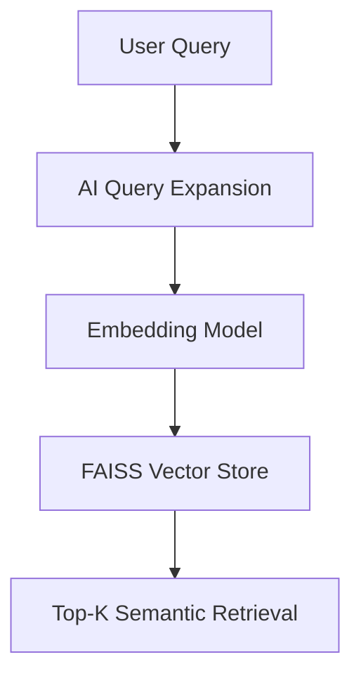
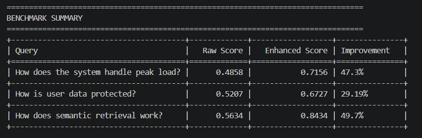
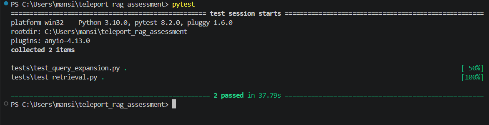

# Semantic RAG & Vector Search

A production-oriented local Retrieval-Augmented Generation (RAG) pipeline implementing semantic retrieval, vector similarity search, AI-enhanced query expansion, and benchmark-driven evaluation using FAISS and sentence-transformers.

---

## Overview

This project implements a complete semantic retrieval pipeline designed to simulate modern Retrieval-Augmented Generation (RAG) systems used in production AI infrastructure.

The system compares two retrieval strategies:

- **Strategy A — Raw Vector Search**
- **Strategy B — AI-Enhanced Retrieval using Query Expansion**

The benchmark demonstrates how semantic query expansion improves retrieval relevance and embedding alignment in vector search systems.

---

## Key Features

- Semantic text embeddings using `sentence-transformers`
- FAISS-based vector similarity search
- AI-enhanced query expansion pipeline
- Benchmark-driven retrieval evaluation
- Modular retrieval architecture
- Automated test coverage using `pytest`
- Production migration considerations for Vertex AI

---

## System Architecture



---

## Retrieval Strategies

### Strategy A — Raw Vector Search

The original user query is directly converted into embeddings and searched against the vector database.

### Strategy B — AI-Enhanced Retrieval

The query is semantically expanded using a mocked generative AI model before embedding generation.

This improves semantic alignment between sparse user queries and domain-specific terminology.

---

## Technologies Used

| Component | Technology |
|---|---|
| Language | Python |
| Embedding Model | sentence-transformers |
| Vector Database | FAISS |
| Benchmarking | tabulate |
| Testing | pytest |
| Similarity Metric | Cosine Similarity |

---

## Project Structure

```text
semantic-rag-vector-search/
│
├── data/
│   └── documents.txt
│
├── src/
│   ├── benchmark.py
│   ├── embedding.py
│   ├── main.py
│   ├── query_expander.py
│   ├── retriever.py
│   └── vector_store.py
│
├── tests/
│   ├── test_query_expansion.py
│   └── test_retrieval.py
│
├── assets/
│   ├── benchmark_output.png
│   └── test_results.png
│
├── benchmark_results.json
├── retrieval_benchmark.md
├── README.md
├── requirements.txt
└── .gitignore
```

---

## Benchmark Queries

The evaluation compares retrieval quality using three infrastructure-focused semantic queries:

1. How does the system handle peak load?
2. How is user data protected?
3. How does semantic retrieval work?

---

## Benchmark Results

| Query | Raw Score | Enhanced Score | Improvement |
|---|---|---|---|
| How does the system handle peak load? | 0.4858 | 0.7156 | +47.3% |
| How is user data protected? | 0.5207 | 0.6727 | +29.19% |
| How does semantic retrieval work? | 0.5634 | 0.8434 | +49.7% |

---

## Benchmark Analysis

The AI-enhanced retrieval pipeline consistently outperformed direct vector search by enriching sparse user queries with semantically related infrastructure terminology.

Expanded semantic context improved embedding alignment and resulted in more contextually relevant retrieval across all benchmark scenarios.

---

## Benchmark Output



---

## Automated Test Results

The retrieval pipeline and query expansion logic are validated using automated unit tests.



---

## Similarity Metric Choice

This project uses **Cosine Similarity** implemented through normalized embeddings and FAISS Inner Product search.

### Why Cosine Similarity?

Cosine similarity measures semantic direction rather than vector magnitude, making it highly effective for high-dimensional text embeddings.

Compared to Euclidean distance, cosine similarity generally performs better for semantic retrieval tasks.

---

## Running the Project

### Clone Repository

```bash
git clone <YOUR_GITHUB_REPOSITORY_LINK>
```

---

### Install Dependencies

```bash
pip install -r requirements.txt
```

---

### Execute Benchmark

```bash
cd src
python main.py
```

---

### Run Tests

```bash
pytest
```

---

## Example Output

```text
+-------------------------------------------+-------------+------------------+-------------+
| Query                                    | Raw Score  | Enhanced Score   | Improvement |
+-------------------------------------------+-------------+------------------+-------------+
| How does the system handle peak load?    | 0.4858     | 0.7156           | 47.3%       |
| How is user data protected?              | 0.5207     | 0.6727           | 29.19%      |
| How does semantic retrieval work?        | 0.5634     | 0.8434           | 49.7%       |
+-------------------------------------------+-------------+------------------+-------------+
```

---

## Production Migration to Vertex AI

This local prototype can be extended into a production-scale retrieval architecture using:

- Vertex AI textembedding-gecko
- Vertex AI Matching Engine
- Gemini query rewriting
- Cloud Storage ingestion pipelines
- Kubernetes deployment
- Streaming vector indexing

---

## Future Improvements

- Hybrid BM25 + Vector Retrieval
- Cross-Encoder Re-ranking
- Metadata Filtering
- Incremental Index Updates
- Streaming Document Ingestion
- Distributed Vector Search
- Real-time Embedding Pipelines

---

## Engineering Highlights

- Modular retrieval pipeline architecture
- Benchmark-oriented evaluation methodology
- Semantic retrieval optimization
- Vector search implementation using FAISS
- AI-assisted query expansion workflow
- Production-oriented system design considerations

---

## Author

**SUCHET YADAV**

AI Engineering | Semantic Retrieval | Vector Search | RAG Systems
